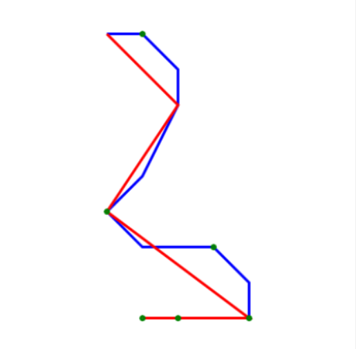

Problem:
you are given a sequence of points where the plane flew (eg. every minute). Most of the time it flights straight. Pick the least amount of points, so that the new path is within some given distance from the original path.

Solution:
It uses win forms to visualize the original path (blue) and the new approximated path (red). 
The solution found is not optimal (the least number of points), what would be NP-complete problem. The solution found is suboptimal.
Complexity of solution used is O(n^2) in general. It uses optimization, so that for appropriate input, the complexity is up to O(n). 
The optimization checks reduced path just against cornerpoints (green) that are situated on the original path.

